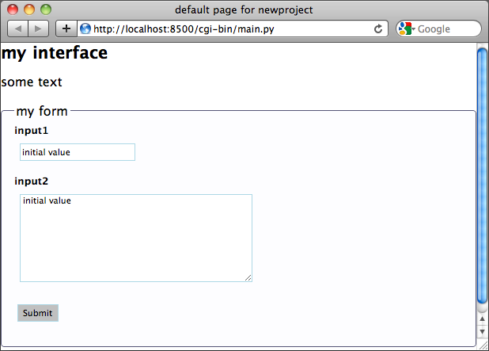
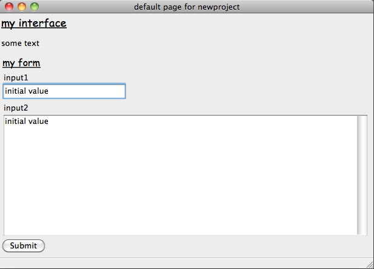

.. _philosophy:

Concepts
========

Luban is based on a simple philosophy: a user interface can be created
by first creating a specification of the interface and then, when needed,
this specification can be rendered into UI application in different media:
for example, in the case of web application, the UI specification can
be rendered tohtml, javascript, json, ajax calls, and more.

Currently, a user interface specifcation in luban consists of

* user interface elements (widgets)
* actions (to talk to application controller, to manipulate the UI elements, and others)

So a UI developer using luban no longer needs to think of implementing
user interface in any specific language/widgetset like html or wxpython,
all is needed is an abstract description of the interface. In luban, this
abstract description is a hierarchy of UI elements, and here is an example::

 + document(title="my interface")
 |-- paragraph(text=['some text'])
 |-+ form(title='my form')
   |-- textfield(label='input1', value='initial value')
   |-- textarea(label='input2', value='initial value')
   |-- submitbutton(label='Submit')

This representation can be rendered as a web user interface:

or a native GUI:

To give the interface dynamic behavior,
actions need to be assigned to the UI elements.
For example, to let the interface respond to the event
of user click on the submit button, an action need to be 
assigned to the "onsubmit" event handler of the form::

 >>> form.onsubmit = alert("form submitted")

Here, "onsubmit" is the event handler of "submit" event of the form,
where "alert(...)" is the specification of the action to be taken at the event.
The action specification will rendered by luban into necessary
code (javascript code in case of web application) to perform the action.

It is very important to understand that what we are doing with luban is
to provide specification of user interface. 
The code ::

 alert("...")

does not show the alert window immediately; instead, it just creates
a description of the action "alert" with necessary arguments.
This specification will be rendered into real action only at run time.

To see what luban can do, please go to :ref:`Demos <demos>`.

If you think luban might have value for you, please start trying it out
by first :ref:`installing it <Installation>`, and then 
following :ref:`Tutorials <Tutorials>`.

A full list of widgets, event handlers, and actions can be found
in :ref:`API documentation <API>`.

