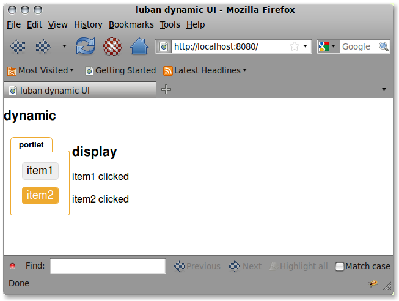
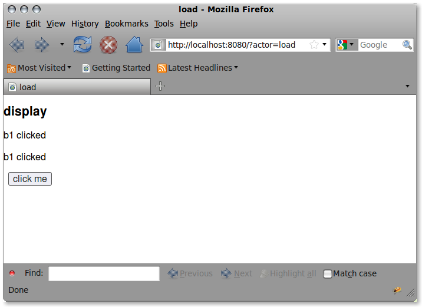

.. _dynamic-ui-tutorial:

Dynamic User Interfaces
-----------------------

Making dynamic user interfaces in luban is easy.
The trick is to assign action(s) to an event handler.

Create a luban project::

 $ cd /somewhere
 $ luban create dynamic

.. note::
   Before starting this new project, make sure you have already shut down other
   projects that might be using the same port; otherwise you will get
   an error message suggesting you use a different port.

Then start this new project::

 $ luban start dynamic

Making a Portlet with Actions
=============================

Use your favorite editor to edit dynamic/python/dynamic/actors/start.py
and change it into::

 import luban
 from luban.controller.Actor import Actor as base
 
 class Actor(base):
 
     expose = 1
 
     def default(self):
         frame = luban.e.frame(title="luban dynamic UI")
         doc = frame.document(title="dynamic")
  
	 # split space to left and right
         sp = doc.splitter()
	 left = sp.section(id='left', Class='align-top')
         right = sp.section(id='right', Class='align-top')
	 
	 # portlet on the left
         portlet = left.portlet(title='portlet')
	 
	 # display on the right
	 display = right.document(title='display', id='display')
 
         # item 1
         item1 = portlet.item(label='item1')
         item1.onselect = luban.a.select(element=display).append(
	     newelement = luban.e.paragraph(text='item1 selected'))
 
         # item 2
         item2 = portlet.item(label='item2')
         item2.onselect = luban.a.select(element=display).append(
	     newelement = luban.e.paragraph(text='item2 selected'))
 	     
 	 	 
         return luban.a.establishInterface(frame)

Refresh and click on the portlet items, which will show something like this:

   Figure 1. Dynamic behavior with a portlet.

A Few Concepts
==============

Each UI element has some events.

Each event has an event handler that can be assigned to an action.

An action could be 

* selecting a UI element and then calling an action on this selected element.
  For example::

  >>> luban.a.select(element=display).append(newelement = ...)

* a simple action like "alert" that shows an alert message box

  >>> luban.a.alert("hey")

* an action to talk to the controller and to ask a method of
  an actor in the controller to do some complex things. 
  At the end of the call, the method should return an action
  that can be any of the three types of actions 
  listed here.

  >>> luban.a.load(actor=..., routine=..., **kwds)

The "Load" action
=================
Here we explain the "load" action further.
This action calls a method of an actor in the controller
and takes the result of that call and works on it.

.. note::
   The result of a "load" action must be a value of luban type.

.. note::
   luban types:
   
   * simple types like str, number
   * container types like list and dictionary
   * luban ui elements
   * luban ui actions

Typically, a "load" action returns another action.
Let us create another actor to show how this works.
Create dynamic/python/dynamic/actors/load.py with the following content::

 import luban
 from luban.controller.Actor import Actor as base 
 
 class Actor(base):
 
     expose = 1
 
     def default(self):
         frame = luban.e.frame(title="load") 
         display = frame.document(title="display", id="display")
         button = frame.button(label="click me", name='b1')
         button.onclick=luban.a.load(actor=self.name, routine="onb1click")
         return luban.a.establishInterface(frame)

     def onb1click(self, **kwds):
         p = luban.e.paragraph(text="b1 clicked")
         return luban.a.select(id="display").append(newelement=p)

and then point your browser to http://localhost:8080/load

Click on the button a couple of times, and
you should see something like this:

   Figure 2. load action that returns another action.

More Examples
=============
See http://lubanui.org/aokuang for more examples, especially
on how the "load" action is used.

More
====
Continue to the :ref:`next tutorial "Styling your interface" <styling-tutorial>`

or back to 
:ref:`"Tutorials" <user-tutorials>`

or back to
:ref:`"User Guide" <user-guide>`
