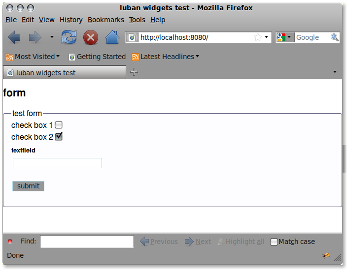

.. _form-tutorial:

Forms
-----

Create a luban project::

 $ cd /somewhere
 $ luban create form

Before starting this new project, make sure you already shutdown other
projects that might be using the same port, otherwise we will see 
the server trying to start up but fail because of conflict port.

Then we start this new project::

 $ luban start form

Add a form
==========
Let us now make some modifications to the interface.

Use your favorite editor to edit form/python/form/actors/default.py
and change it into::

 import luban
 from luban.controller.Actor import Actor as base
 
 class Actor(base):
 
     expose = 1
 
     def default(self):
         frame = luban.e.frame(title="luban form test")
         doc = frame.document(title="form")
 
         # form
         form = doc.form(title='test form')

         # fields
         # .. check boxes
         checkbox1 = form.checkbox(
             name='boolvar1', label='check box 1', checked=False)

         checkbox2 = form.checkbox(
             name='boolvar2', label='check box 2', checked=True)

         # .. text field
         textfield = form.text(label='textfield', name='textvar')
        
         # submit button
         submit = form.submitbutton(label='submit')

         # action when form is submitted
	 form.onsubmit = luban.a.alert('submitted')
	 	 
         return luban.a.establishInterface(frame)

Refresh your browser should bring you to sth similar to this:

   Figure 1. A form

If you click the submit button, an alert box will pop up with message
"submitted".

But this really does not send any form data to the "server side".
We need to modify the "onsubmit" event handler a bit to make that happen.
Change::
 
	 form.onsubmit = luban.a.alert('submitted')

to ::
 
         form.onsubmit = luban.a.load(
             actor = self.name,
             routine = 'process',
             kwds = luban.event.data,
             )

and add the following method to the default actor::
 
     def process(self, **kwds):
         msg = "submitted: %s" % (kwds,)
         return luban.a.alert(msg)

The default.py will look like::

 import luban
 from luban.controller.Actor import Actor as base
 
 class Actor(base):
 
     expose = 1
 
     def default(self):
         frame = luban.e.frame(title="luban form test")
         doc = frame.document(title="form")
 
         # form
         form = doc.form(title='test form')

         # fields
         # .. check boxes
         checkbox1 = form.checkbox(
             name='boolvar1', label='check box 1', checked=False)

         checkbox2 = form.checkbox(
             name='boolvar2', label='check box 2', checked=True)

         # .. text field
         textfield = form.text(label='textfield', name='textvar')
        
         # submit button
         submit = form.submitbutton(label='submit')

         # action when form is submitted
         form.onsubmit = luban.a.load(
             actor = self.name,
             routine = 'process',
             kwds = luban.event.data,
             )
	 	 
         return luban.a.establishInterface(frame)
	 
	 
     def process(self, **kwds):
         msg = "submitted: %s" % (kwds,)
         return luban.a.alert(msg)

You can try to change the values of the form controls, and then
submit the form. You will be prompted with an alert message box like this:

   Figure 2. form data submitted to "server side", and then an action
   is returned from the handling routine that asks for showing an
   alert message box with submitted dta.
