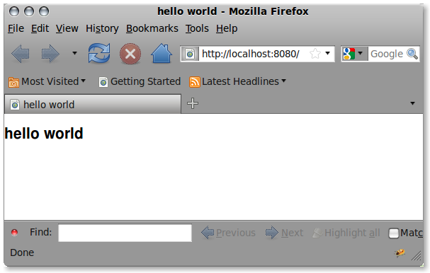

.. _helloworld:

Hello world!
------------

If you have not done so, please
:ref:`install luban <installation>` first.

Create helloworld
=================

Create a luban project::

 $ cd /somewhere
 $ luban create helloworld

Start this new project::

 $ luban start helloworld

A server will be running to serve your web application,
and a browser will be started to show the webpage:

   Figure 1. Hello world application

Congratulations!!! You have created your first luban user interface!

Modifying the Interface
=======================
Let us now make some minor modifications to the interface.

Use your favorite editor to open helloworld/python/helloworld/actors/start.py.
It reads::
 
 import luban
 from luban.controller.Actor import Actor as base
 
 class Actor(base):
 
     expose = 1
 
     def default(self):
         frame = luban.elements.frame(title="hello world")
         frame.document(title="hello world")
         return luban.actions.establishInterface(frame)

Let us change it to::

 import luban
 from luban.controller.Actor import Actor as base
 
 class Actor(base):
 
     expose = 1
 
     def default(self):
         frame = luban.elements.frame(title="hello world")
         doc = frame.document(title="hello world")
         doc.paragraph(text = "This is my first luban user interface")
         return luban.actions.establishInterface(frame)

You will see in the terminal where you started the luban project
that the server is reloading to incoporate your changes.
Now you can refresh the browser 
and see the changes.

A Few Concepts
==============

An *actor* lives on the "server side" and responds to client requests.

The entry point of a luban application is 
by default the "default" method of the "start" *actor*.
It should return an "establishInterface" action that establishes
the user interface from a *frame* instance.

A user interface is represented by a hierarchical structure of 
UI elements.

The root of this hierarchical structure is a *frame*.

element factory and element hierarchy
~~~~~~~~~~~~~~~~~~~~~~~~~~~~~~~~~~~~~
To create a *frame*, use the luban.elements.frame factory method::

 >>> frame = luban.elements.frame(title="hello world")

.. note::
   *luban.elements* is a proxy to factory methods for creating luban elements.
   For example, *luban.elements.frame* is a factory method to build a 
   *frame* luban element.
   An alias is also provided for convenience::
   
    luban.e = luban.elements

   so that, for example, instead of ::
   
    >>> luban.elements.frame(...)
    
   you can do ::

    >>> luban.e.frame(...)

Now the interface hierarchy is::

 - frame(title="hello world")

To create sub elements in a *frame*, call the element factory 
on the *frame* instance::

 >>> doc = frame.document(title="hello world")

And now the interface hierarchy is::

 + frame(title="hello world")
   - document(title ="hello world")

Similarly, to create a sub element in the first sub element of the *frame*,
you call the element factory on the subelement "doc"::

 >>> doc.paragraph(text = "This is my first luban user interface")

And now the interface hierarchy is::

 + frame(title="hello world")
   + document(title ="hello world")
     - paragraph(text = "...")

.. note::
   Any element container can create a subelement by calling
   the factory method whose name is the subelement type::

     >>> <container>.<elementtype>

   For example::

     >>> frame.document(...)
     >>> frame.paragraph(...)
     >>> doc.paragraph(...)
     >>> doc.document(...)

action
~~~~~~
Now we look at the last statement in the "default" method::

 >>> return luban.actions.establishInterface(frame)

When luban is interpreting that action, it will try
to establish a user interface from the given *frame*.

There are relatively few types of actions in luban, but their combinations
make luban very powerful.
:ref:`click here for more explanations of actions <philosophy-actions>`,
and `click here for examples of luban actions <http://lubanui.org/aokuang>`_.

.. note::
   Similarly to *luban.elements*, 
   *luban.actions* is a proxy to factory methods for creating luban actions.
   Furthermore, an alias of *luban.actions* is also provided for convenience::

    luban.a = luban.actions

   so that, for example, instead of ::

    >>> luban.actions.establishInterface(...)
    
   you can do ::

    >>> luban.a.establishInterface(...)

Shutting Down the Server
========================

After you finish playing with this "helloworld" example, you can shut
down the server by hitting **control-C**. 

.. note::
   The stopping process may take a bit of time; please be patient :)

You can also stop it by ::
 
 $ luban stop /path/to/helloworld

More
====

Continue to the :ref:`next tutorial "Adding widgets" <widgets-tutorial>`

or back to 
:ref:`"Tutorials" <user-tutorials>`

or back to
:ref:`"User Guide" <user-guide>`
