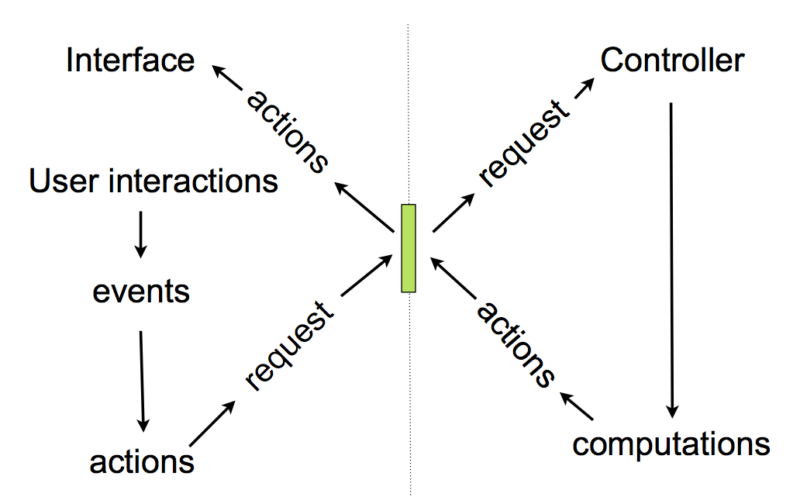

.. _philosophy:

Luban User Interface Language Core
==================================

Principles
----------

Minimalist approach
"""""""""""""""""""
We look for the most compact conceptual structure
sufficient to describe a sophisticated, dynamic, and mordern
user interface.

We encourage separation of UI logic and visual effects
""""""""""""""""""""""""""""""""""""""""""""""""""""""
Visual appeals (eye candies) could be separated from UI logic.
Many have realized that visual appeals are certainly very very important
for  user experiences,
especially after the success of Apple.
In luban, we notice that visual appeal could be evolved
without changing the UI logic.
And luban is a "language" mainly 
for the purpose of describing the UI logic,
not the visual appeal.
An argument of that was presented in one of Jiao's responses in
`the thread started by Guido regarding luban <https://plus.google.com/115212051037621986145/posts/ThMuTvwut9g>`_,
and
quoted here::

 ...... Regarding fine-tuning
 web UI for better user experiences, Luban is not a thing that you cannot 
 change. You can customize the widgets, or replace widgets with your own 
 implementations, or add new widgets as fancy as you like. One benefit of 
 using luban is a clean separation of the (js/html5) code for visual appeal 
 from the real user interface logic. You can fine-tune the visual appeal of 
 your user interface in your implementation of the widget, instead of 
 touching the final page generated by luban. Luban is not trying to 
 take away all your capabilities of doing all the nice js/html5 tricks, 
 but rather it could help you better structure your code. 
 For example, let us say we want to implement the google circle widget 
 (the circle that when hovered shows a bunch of icons of contacts) into 
 which a user can drop a contact. In essence, we can say that one important 
 behavior of that circle widget is
 
 when a user widget is dropped into a circle widget, add a user 
 representation (icon) into the circle widget
 
 roughly in the spirit of luban, the code could look like
 
 >>> circle_widget.ondrop = circle_widget.add(dropped.icon)
 
 while on the javascript implementation of this circle widget, 
 you will have code for animations to make it look nice. 
 Imagine in the future, it could be possible the visual effect 
 would be that the circle is a 3d scene of people standing in a 
 circle moving and chatting, and the implementation of 3d scene would be 
 still all on the javascript/html5/future-technology side, while the ui logic 
 will remain unchanged. So luban will essentially help/force you separate 
 clearly the eye candy part of your user interface and the real ui logic part, 
 and give your widget a clean, simple API.

Type system
-----------
Luban has a very limited type system. 

* primitive types: bool, str, int, float 
* containers
 * list: a list of instances of luban types
 * dictionary: key value pairs. key: str type. value: instance of any luban type
* object: generic luban object that defines attributes (name: str, value: instance of any luban type). The following are specialized types derived from this generic object type.
 * element: UI elements (widgets)
 * action: actions to update UI or to communicate with controller
 * event: events triggered by user interactions with the UI

Instances of luban object types could be regarded as specialized dictionaries that has a fixed set of keys, and the corresponding values may be limited to be of one specific luban type. Luban object type does not have methods, but only has attributes.

Basic concepts and structure
----------------------------
A *user interface* is described using a hierarchical structure
consisting of ui *elements*.

A *controller* is responsible for constructing and returning
instances of luban types upon *request*. 

A *request* is identified by its parameters (e.g. "actor", "routine", ...)

There is no real reason that there could not be more than 1
controller. But here we assume only one controller exists, 
for simplicity of this discussion.

A *user interface* starts by a *request* to the UI *controller*
whose response is an action to establish a UI from a
hierarchy of UI element nodes with a root node being of the "Frame" type.
"Frame" is a special UI element type.

User interactions with the UI results in *events*.

An *event* will trigger an associated *action*.
The association of an *action* with an *event* is done by assigning the
*action* to the *event handler* (an attribute) of an *element*.

An *action* could be changing visual representation of
a UI *element*, or loading some data from the *controller*
to update a UI *element*, or loading another *action* from
*controller* to execute.

   Figure 2. UI and controller

Controller
""""""""""
When receiving a request, the controller must
prepare a response according to the request,
and send the response back to the UI.

A response always is an instance of a luban type.

A scheme is proposed to bring in a structure to
the controller:

* A request always contains the following two parameters

  * actor: name of the actor
  * routine: name of the routine of the actor
* A controller handles a set of "actors"
* Whenever requested, it delegates
  to the specified actor to perform the specified routine
  with additional parameters.
* This routine will produce a response depending
  on whatever extra parameters given to it.

Elements
""""""""
A visual element in the user interface.

A ui element has the following attributes:

* properties
* event handlers
* sub elements (for element container only)

Property
********
Examples of properties:

* paragraph.text: the text string for a paragraph element
* <element>.class: similar to the idea of css class. A class of an element can be used by fine tune the styling.
* document.title: the title of a document element

Event handler
*************
An event handler corresponds to one type of event.
For example, "onclick" event handler will be fired when
an element is clicked.

A event handler has to be assigned a null value (in case of python, None),
or an action.

Sub elements
************

Instances of element container types can have sub elements.
For example, a "Document" instance can have a paragraph
as one of its sub elements.
It can also have another document as a sub element.

Frame
*****

Frame is a special type of UI element.
A frame element can only be the root of a UI element hierarchy,
and it cannot be a sub element.

An element hierarchy example
****************************

An example::

 + document(title="main document")
   - paragraph(text=['some text'])
   + form(title='my form')
     - textfield(label='input1', value='initial value')
     - textarea(label='input2', value='initial value')
     - submitbutton(label='Submit')

Actions
"""""""
"Action" is a category of luban object types that describe
actions that update the UI, or actions to load something
from the controller (which may in the end update the UI as well).

It is worth to reiterate that the action types in luban
are very limited: it is either directly changing the UI,
or ask the controller for information that will lead to 
actions that change the UI. No way is included in luban
to describe complex logic, for example. 
This approach keeps luban a very simple "language" --
it in essence only defines a vocabulary (that is
redefinable) of nouns (UI elements) and verbs (UI actions),
and there is no way of doing complex language constructs
like "if ... else ...".
It is assumed that any complex behavior is either 
absorbed into the implementations of the UI elements (widgets), or
is performed by an actor of the controller using more powerful
languages (could be on client side or server side).

An action is an instance of a luban action type, and
it has properties that defines the behavior of the action.

Following are more details of the types of actions

Simple naive actions
********************

* Alert(message=<text>): show an alert window with the given message

Element selector
****************

* SelectByIDandType(id=<id>, type=<optinal>): select an element by its id, and optionally its type

Element actions
***************
Actions that update a UI element. Examples:

* ReplaceContent(element=<element selector>, newcontent=<luban element hierarchy>): replace the content of the given element with the new content

Action to talk to the controller
********************************

* Load(actor=<actor name>, routine=<routine name>, ..extra parameters..)

This action asks the controller to run the given routine of the
given actor with all the extra parameters, and obtain the returned value.

If the returned value is another action, that action will then be performed.
For example, if the returned value is the action::

 Alert(message="hello")

this action will be performed and an alert window will pop up.
Usually what happen will be that the controller will carry out some
computations and depending on the computation result, return an appropriate
action to perform on the user interface side.

The returned value could be an instance of luban types other than an action.
For example, in pseudo code::

 button.onclick = \
   select(id="help-message-window")\
     .replaceContent(
       load(actor="helper", 
            routine="getMessage", 
            topic="Monte Carlo simulations"
           )
     )

Apparantly the returned value from actor "helper", routine "getMessage"
will be a luban UI element hierarchy.
That UI element hierarchy will replace the original content of the
existing UI element that can be identified by its id "help-message-window".

Events
""""""
"Event" is a category of luban object types that describe
events happen to the user interface.

Event data are captured as properties of an event object.

For example::

 TabSelect(oldtab=<old tab id>, newtab=<new tab id>)

is a type of event happens when a tab is selected.

Summary
-------
Up until now, all discusions don't assume any implementation
of the luban specification "language". 
You can see that the core of luban only consists of
luban types to describe UI elements, actions,
and events, and their connections through attributes and also
controller.

.. In the next section, we will discuss to how to 
.. program luban with python. 
.. next: :ref:`core-implementation-python`

