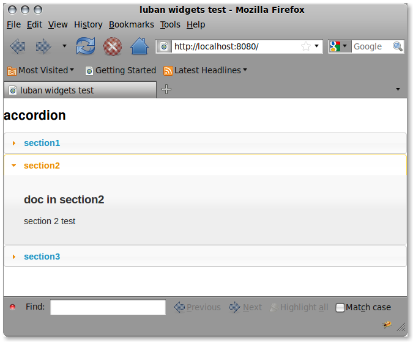
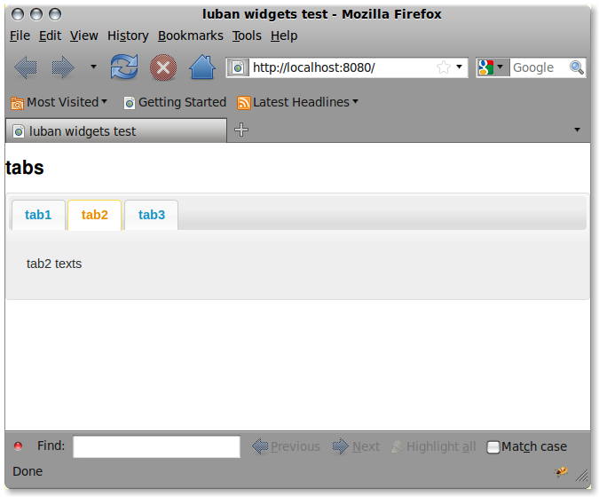

.. _widgets-tutorial:

Adding widgets to your interface
--------------------------------

Create a luban project::

 $ cd /somewhere
 $ luban create widgets

Before starting this new project, make sure you already shutdown other
projects that might be using the same port, otherwise we will see 
the server trying to start up but fail because of conflict port.

Then we start this new project::

 $ luban start widgets

Add an accordion
================
Let us now make some modifications to the interface.

Use your favorite editor to edit widgets/python/widgets/actors/default.py
and change it into::

 import luban
 from luban.controller.Actor import Actor as base
 
 class Actor(base):
 
     expose = 1
 
     def default(self):
         frame = luban.e.frame(title="luban widgets test")
         doc = frame.document(title="accordion")
	 acc = doc.accordion()

         sec1 = acc.section(label='section1')
         sec1.paragraph(text='paragraph in section1')
         
         sec2 = acc.section(label='section2', selected=1)
         doc2 = sec2.document(title='doc in section2')
         doc2.paragraph(text='section 2 text')
    
         sec3 = acc.section(label='section3')
         sec3.paragraph(text='text text text')
    
         return luban.a.establishInterface(frame)

Refresh your browser should bring you to sth similar to this:

   Figure 1. Accordion widget

You can click on the accordion to see its behavior.

"tabs"
======
Now let us try the widget "tabs". Replace default.py with the following content::

 import luban
 from luban.controller.Actor import Actor as base
 
 class Actor(base):
 
     expose = 1
 
     def default(self):
         frame = luban.e.frame(title="luban widgets test")
         doc = frame.document(title="tabs")

         tabs = doc.tabs()
         tabs.tab('tab1').paragraph(text='tab1 texts')
         tabs.tab('tab2', selected=1).paragraph(text='tab2 texts')
         tabs.tab('tab3').paragraph(text='tab3 texts')
	 
         return luban.a.establishInterface(frame)

Refresh your browser should bring you to sth similar to this:

   Figure 2. Tabs widget

More widgets
============

To see more widgets, go to http://lubabui.org/aokuang
